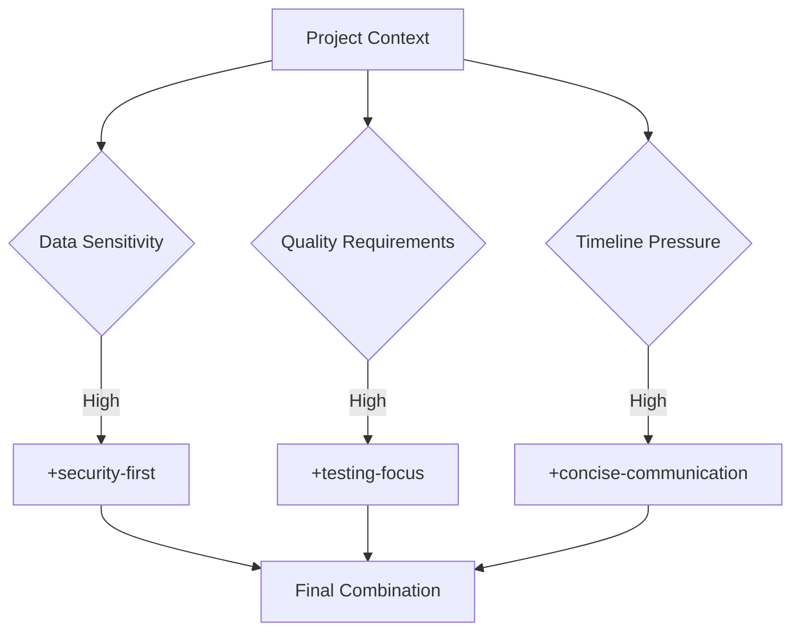

# Enhancement Directives

This folder contains optional enhancement modules that modify the framework agent's behavior for specific requirements. Directives are stackable and can be combined with any playbook to customize the development approach.

## 📁 Files Overview

### 💬 `concise-communication.md`
**Purpose**: Radically concise, information-dense responses  
**Token Impact**: Neutral (modifies output style, not input size)  
**Focus**: Maximum information density with minimal conversational overhead

**Key Features**:
- Eliminates conversational filler and pleasantries
- Structured status reporting with emoji indicators
- Evidence-first communication with concrete proof
- Streamlined response templates for efficiency

**When to Use**:
- ✅ High-frequency development sessions
- ✅ Status reporting and progress updates
- ✅ Time-sensitive or urgent work
- ✅ Large team coordination with many updates
- ✅ Cost-sensitive environments with many interactions

**Avoid When**:
- ❌ Complex planning phases requiring detailed explanation
- ❌ Team training or onboarding scenarios
- ❌ Stakeholder communication requiring context
- ❌ First-time framework usage

### 🧪 `testing-focus.md`
**Purpose**: Test-driven development and comprehensive QA emphasis  
**Token Impact**: +2000-4000 tokens (comprehensive testing protocols)  
**Focus**: Quality-first development with extensive testing strategies

**Key Features**:
- Mandatory TDD cycle enforcement (RED-GREEN-REFACTOR)
- Comprehensive testing strategy (Unit → Integration → E2E)
- Performance and security testing integration
- Quality gate enforcement with measurable criteria
- Test coverage and maintenance protocols

**When to Use**:
- ✅ Mission-critical features and systems
- ✅ Legacy code refactoring projects
- ✅ High-reliability requirements
- ✅ Compliance and audit requirements
- ✅ Team learning and best practice adoption

**Avoid When**:
- ❌ Simple bug fixes requiring immediate resolution
- ❌ Prototype or proof-of-concept development
- ❌ Emergency production issues
- ❌ Documentation-only changes

### 🔒 `security-first.md`
**Purpose**: Security-by-design development approach  
**Token Impact**: +2000-3000 tokens (security protocols and validation)  
**Focus**: Comprehensive security integration throughout development lifecycle

**Key Features**:
- Threat modeling and security design patterns
- Security testing and vulnerability assessment
- Compliance and regulatory requirement integration
- Security control implementation and validation
- Incident response and security monitoring

**When to Use**:
- ✅ Authentication and authorization systems
- ✅ Payment processing and financial systems
- ✅ Sensitive data handling (PII, healthcare, etc.)
- ✅ Public-facing APIs and services
- ✅ Compliance-critical applications (HIPAA, SOX, etc.)

**Avoid When**:
- ❌ Internal tools with no sensitive data
- ❌ Proof-of-concept or demo applications
- ❌ Simple UI changes without data handling
- ❌ Emergency fixes for non-security issues

### 🎯 `strategic-tactical.md`
**Purpose**: Bridge high-level business strategy with tactical implementation decisions  
**Token Impact**: +475 words (~595 tokens)  
**Focus**: Strategic systems thinking with tactical execution and constraint-aware reasoning

**Key Features**:
- Multi-dimensional constraint analysis (Resource, Technical, Business, Quality, Organizational, External)
- Stakeholder impact assessment across primary and secondary stakeholders
- Long-term architectural consideration and technical debt analysis
- Resource optimization and strategic decision templates
- Architecture Decision Record (ADR) frameworks

**When to Use**:
- ✅ Complex features with broad system impact
- ✅ Architectural decisions affecting multiple teams
- ✅ Resource-constrained environments requiring optimization
- ✅ Projects with competing business priorities
- ✅ Cross-team coordination and dependency management

**Avoid When**:
- ❌ Simple bug fixes with isolated scope
- ❌ Emergency production issues requiring immediate resolution
- ❌ Well-defined tasks with clear constraints
- ❌ Prototype or proof-of-concept development

### 🔍 `critical-review.md`
**Purpose**: Apply rigorous critical analysis and business validation to prevent costly mistakes  
**Token Impact**: +400+ words (~500+ tokens)  
**Focus**: Business value validation and assumption challenging with evidence-based decision making

**Key Features**:
- Challenge Every Assumption Protocol for business and technical assumptions
- Critical Question Framework with "What Could Go Wrong?" analysis
- Devil's Advocate mode with requirement and solution interrogation
- Evidence-based validation with 4-tier proof standards (🔴🟡🟢⚪)
- Red flags identification and escalation triggers

**When to Use**:
- ✅ High-stakes features affecting core business operations
- ✅ Complex integrations with external systems
- ✅ Features involving financial transactions or sensitive data
- ✅ Architectural decisions with long-term implications
- ✅ Projects with unclear or changing requirements

**Avoid When**:
- ❌ Well-established patterns with proven track records
- ❌ Small, isolated changes with minimal risk
- ❌ Internal tools with limited business impact
- ❌ Prototype or proof-of-concept development

## 🎛️ Directive Combination Guide

### Compatibility Matrix

| Primary Directive | Secondary Directive | Compatibility | Notes |
|-------------------|---------------------|---------------|-------|
| **concise-communication** | testing-focus | ⚠️ CONDITIONAL | Compatible in execution, conflicts in planning |
| **concise-communication** | security-first | ✅ COMPATIBLE | Security analysis can be communicated concisely |
| **concise-communication** | strategic-tactical | ⚠️ CONDITIONAL | Strategic analysis needs detail, tactical execution can be concise |
| **concise-communication** | critical-review | ❌ CONFLICTING | Critical analysis requires detailed explanation |
| **testing-focus** | security-first | ✅ SYNERGISTIC | Security testing enhances both objectives |
| **testing-focus** | strategic-tactical | ✅ COMPATIBLE | Quality strategy aligns with strategic thinking |
| **testing-focus** | critical-review | ✅ SYNERGISTIC | Critical review enhances testing rigor |
| **security-first** | strategic-tactical | ✅ COMPATIBLE | Security constraints enhance strategic analysis |
| **security-first** | critical-review | ✅ SYNERGISTIC | Critical review enhances security validation |
| **strategic-tactical** | critical-review | ✅ SYNERGISTIC | Critical analysis enhances strategic decision quality |

### Recommended Combinations

#### 🥇 **The Quality Triad** (High-Value Features)
```markdown
Combination: testing-focus + security-first
Token Cost: ~8000-12000 tokens
Use Cases: Payment systems, user authentication, data processing
Benefits: Maximum quality and security coverage
```

#### 🥈 **The Emergency Response** (Production Issues)
```markdown
Combination: concise-communication + security-first
Token Cost: ~6000-8000 tokens  
Use Cases: Security incidents, critical system failures
Benefits: Rapid response with security awareness
```

#### 🥉 **The Efficiency Stack** (Regular Development)
```markdown
Combination: concise-communication only
Token Cost: ~4000-6000 tokens
Use Cases: Regular feature work, code improvements
Benefits: Fast iteration with clear progress tracking
```

## 🚀 Usage Instructions

### Basic Directive Usage
```markdown
# 1. Choose your base playbook
[feature-request.md content]

# 2. Add relevant directive(s)
[security-first.md content]
[testing-focus.md content]

# 3. Use combined prompt
🎯 MISSION BRIEF: [Your specific objective]
[Combined framework content]
```

### Smart Combination Selection

#### Context-Based Selection


#### Team Maturity Considerations
```markdown
## TEAM SKILL LEVELS

### Junior Team
- Use: Single directive maximum
- Focus: Clear guidance and education
- Avoid: Complex directive combinations

### Senior Team  
- Use: Multiple directives as needed
- Focus: Efficiency and advanced patterns
- Leverage: Full framework capabilities

### Mixed Team
- Use: Complexity based on task lead
- Focus: Knowledge transfer
- Balance: Guidance for juniors, efficiency for seniors
```

## 📊 Directive Effectiveness Metrics

### Performance Indicators

**Concise Communication**:
- Response density: Target 50% word reduction
- Clarity score: Target >9/10 readability
- Time savings: Target 30% faster status updates
- Information retention: Target >95% key information preserved

**Testing Focus**:
- Test coverage: Target >95% for business logic
- Defect reduction: Target 50% fewer production bugs
- Quality metrics: Measurable improvement in code quality scores
- Team adoption: Target >80% TDD practice adoption

**Security First**:
- Vulnerability reduction: Target 90% fewer security issues
- Compliance score: Target 100% requirement adherence
- Incident prevention: Measurable reduction in security incidents
- Security awareness: Target >90% team security knowledge

### ROI Analysis

**Token Investment vs. Value**:
```markdown
## COST-BENEFIT ANALYSIS

### Concise Communication
- Token Cost: Neutral (output efficiency)
- Time Savings: 20-30% in communication overhead
- ROI: Immediate positive return

### Testing Focus
- Token Cost: +2000-4000 tokens
- Quality Improvement: 25-50% defect reduction
- ROI: Positive within 2-3 sprints

### Security First
- Token Cost: +2000-3000 tokens
- Risk Reduction: 90% fewer security incidents
- ROI: Positive after first prevented incident
```

## 🔧 Customization Guidelines

### Creating Custom Directives

#### Template Structure
```markdown
# [DIRECTIVE NAME] DIRECTIVE

**🎯 [PURPOSE]**: [Brief description of enhancement]

## 📋 DIRECTIVE OVERVIEW
[When to use and context explanation]

## [ENHANCEMENT SECTION 1]
[Specific modifications to framework behavior]

## [ENHANCEMENT SECTION 2]
[Additional behavioral changes]

## 🎯 SUCCESS CRITERIA
[How to measure directive effectiveness]
```

#### Team-Specific Directives
```markdown
# Examples of team customizations:

## API-FIRST DIRECTIVE
- Emphasizes API design before implementation
- Requires OpenAPI specification
- Mandates client SDK generation

## MICROSERVICES DIRECTIVE  
- Focuses on service decomposition
- Emphasizes container and orchestration
- Requires service mesh integration

## COMPLIANCE DIRECTIVE
- Integrates specific regulatory requirements
- Mandates audit trail documentation
- Requires compliance validation steps
```

### Directive Evolution Process

#### Creation Process
1. **Identify Need**: Recognize recurring specialized requirements
2. **Define Scope**: Clearly bound the directive's purpose and limits
3. **Create Template**: Follow standard directive structure
4. **Test Integration**: Validate with existing playbooks and directives
5. **Measure Effectiveness**: Track impact and value delivery

#### Maintenance Process
1. **Usage Monitoring**: Track adoption and effectiveness metrics
2. **Feedback Collection**: Gather user experience and pain points
3. **Iterative Improvement**: Regular updates based on usage patterns
4. **Deprecation Planning**: Remove unused or ineffective directives

## 🎯 Best Practices

### Selection Guidelines
1. **Start Simple**: Begin with single directives before combining
2. **Measure Impact**: Track effectiveness of each directive
3. **Context Matters**: Choose based on project needs, not preferences
4. **Token Budget**: Consider total prompt size when combining
5. **Team Capability**: Match directive complexity to team experience

### Common Pitfalls
❌ **Over-Engineering**: Using complex directives for simple tasks  
❌ **Directive Conflicts**: Combining incompatible enhancement approaches  
❌ **Token Explosion**: Exceeding reasonable prompt size limits  
❌ **Context Mismatch**: Using directives inappropriate for the situation  
❌ **Change Resistance**: Not adapting directive usage based on outcomes  

### Success Patterns
✅ **Progressive Enhancement**: Start basic, add directives as needed  
✅ **Context Awareness**: Choose directives based on actual requirements  
✅ **Measurement Focus**: Track and optimize directive effectiveness  
✅ **Team Alignment**: Ensure directive choices match team capabilities  
✅ **Continuous Improvement**: Evolve directive usage based on experience  

---

**🎯 Enhance purposefully. Combine wisely. Measure effectiveness.**
